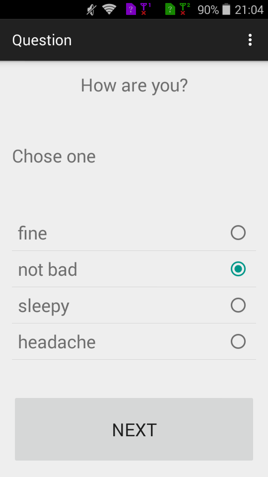
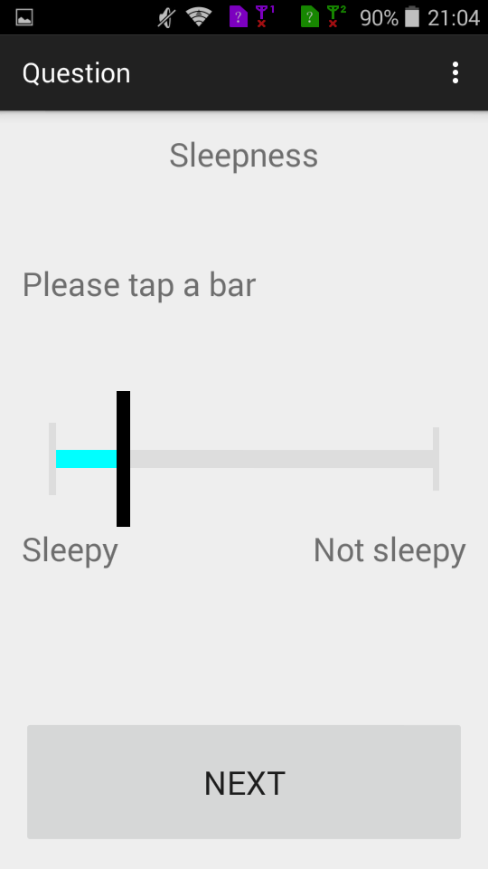
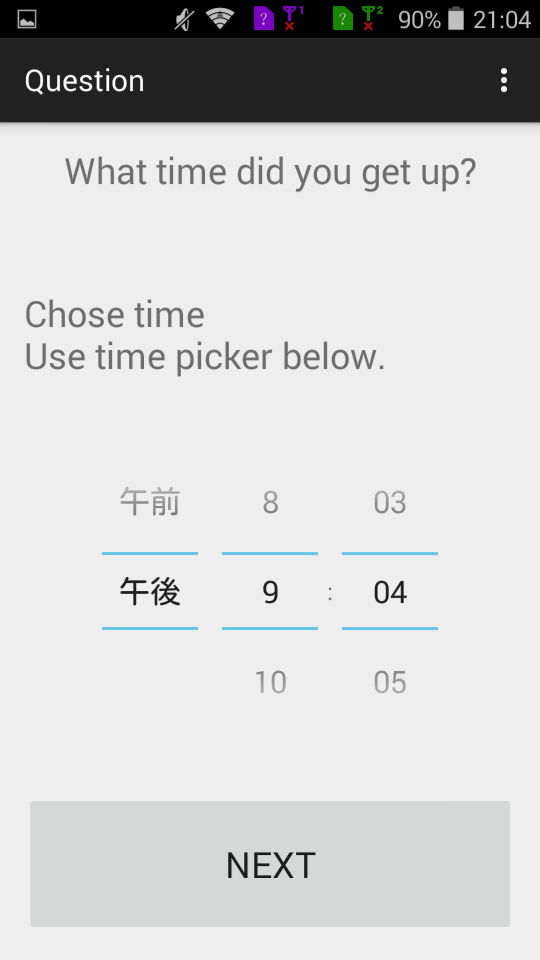
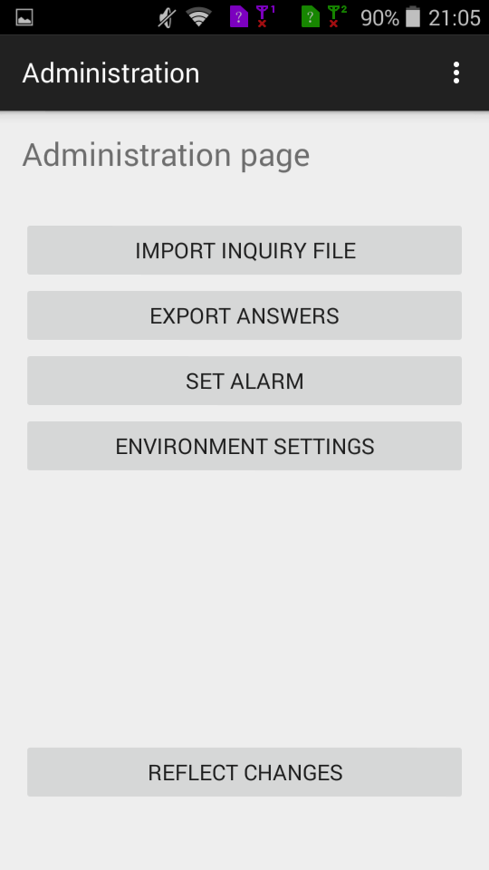
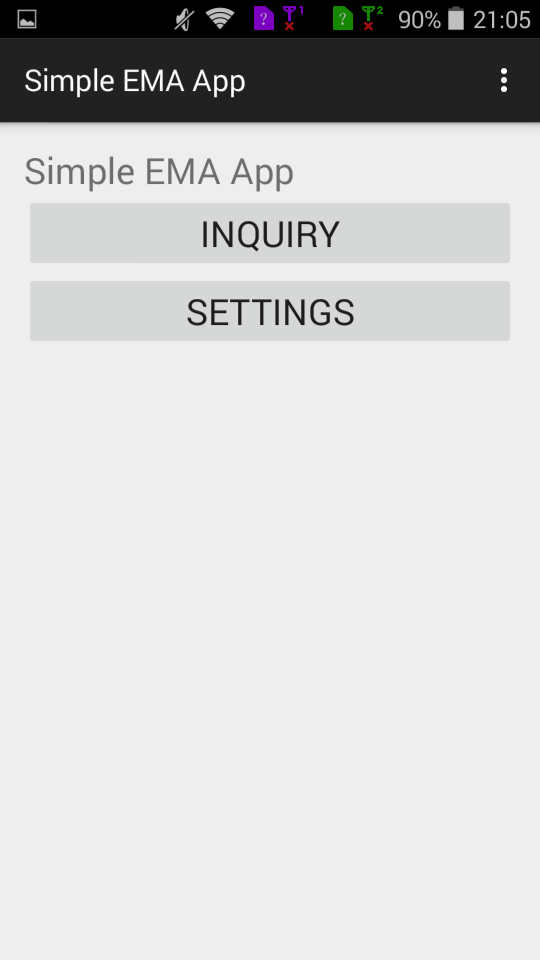
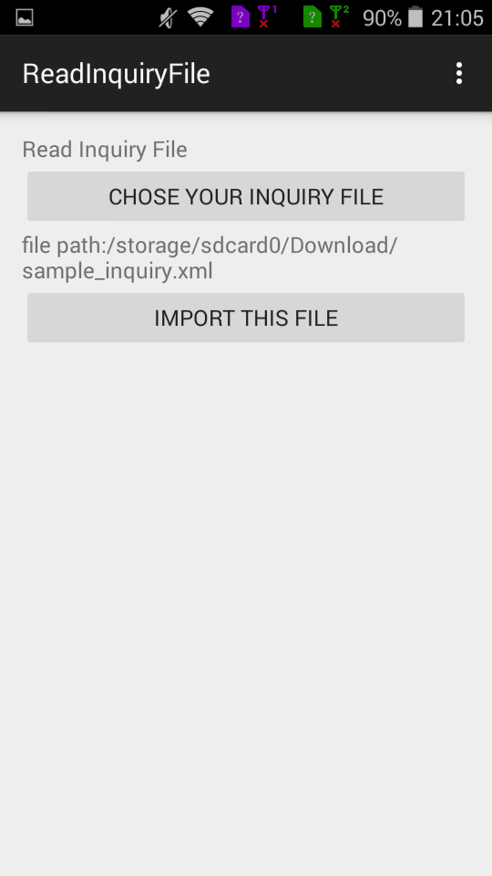

# SimpleEMAapp
##Overview
This app offers a simple templete for ecological momentary assessment (EMA) on Android phone.
##Description
You can set any questions that you would like to ask your subject.
Subject's answers is saved on SQLite database on their phone, and you can export it to csv whenever you want to use.
The functions frequently used in EMA such as setting alarm, changing text size and desplaying visual analog scale (VAS) are available.
We provide you with a most effortless EMA format.
##Demo

##Requirement
Min SDK version is 17 (Android 4.22) and Target SDK version is 21.
My java version is 1.70.

##Usage
####1. Write a inquiry file

Simple EMA app require a inquiry file written as xml format. Sample inquiry file is [here](./inquiry_example.xml).The xml file must have root and question tag. Style of a question is determined in this file. You should copy the inquiry file from your computer to your smart phone.

####2. Login as administrator

Launch the app and goto the top scene then tap the setting button. Initial password is 'simple'.
(You can set your own password by modifying "string_password.xml")
 

 
####3. Import your inquiry

Push 'import inquiry file' button. You will visit read inquiry scene. After selecting your inquiry file that you have written, tap 'import this file' button.
 

 

####4. Set other parameters

Back to previous administration page. You can set/remove alarms or change text size. Finally you should make sure that your questions are properly set.

##Install
Download the apk file on [my personal web site](hkuromiya.nagoya/2016/03/19/simpleemaapp/). Move it to your android phone, and tap it via file manager.

##Lisence
The MIT License (MIT)
